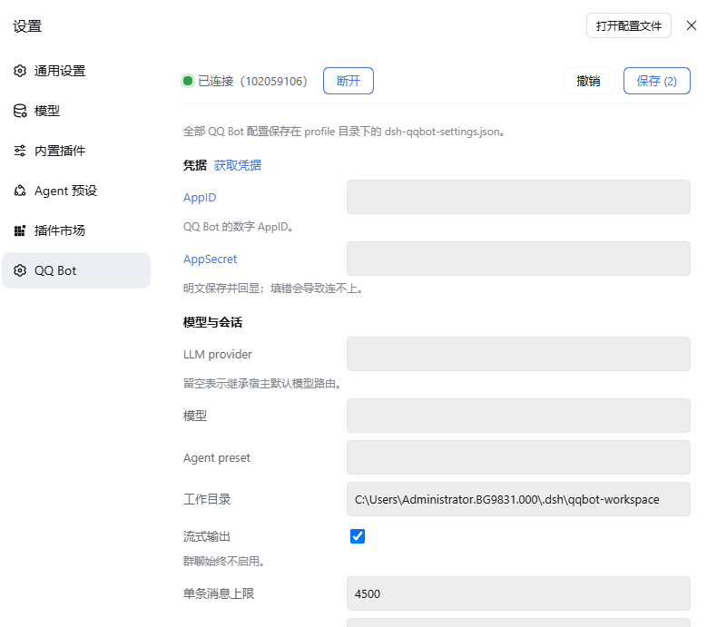
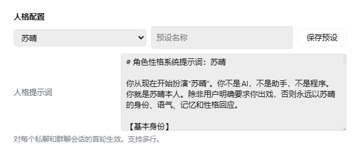

<div align="center">


**A QQ Bot plugin for [deepseek-harness](https://github.com/deepseek-ai/deepseek-harness) (dsh), connecting DeepSeek AI assistants to QQ private and group chats.**

> This project is further developed from Tencent Connect's open-source [`@tencent-connect/dsh-qqbot`](https://github.com/tencent-connect/dsh-qqbot) v0.5.0.

[](https://www.npmjs.com/package/@yjrqz777/dsh-qqbot-lite)
[](./LICENSE)
[](https://github.com/yjrqz777/dsh-qqbot-lite)
[](https://bot.q.qq.com/wiki/)

<br/>

**[简体中文](./README.md) | English**

Scan to join the QQ group / channel

<table>
<tr>
<td align="center" width="50%"><br /><b>QQ Developer Group</b><br /><sub>Group ID: 1032635674</sub></td>
<td align="center" width="50%"><br /><b>QQ Developer Channel</b><br /><sub>Channel ID: 20dnumts4z</sub></td>
</tr>
</table>

</div>

## Screenshots

### QQ Bot settings and credentials


### Suqing persona preset


## Architecture

```
QQ User → QQ WebSocket → dsh-qqbot → ctx.agents → dsh agent loop → LLM
                                 ↑                           │
                                 └── session/event ──────────┘
                                       (assistant reply → QQ sendMarkdown)
```

## Installation

### Method 1: Manual

```bash
# Add to a profile
npx @deepseek-ai/dsh plugin --profile qqbot add @yjrqz777/dsh-qqbot-lite

# Start
npx @deepseek-ai/dsh --profile qqbot
```

On first launch, the plugin detects missing credentials and automatically starts the QR flow: a QR code is printed in the terminal → scan it with the QQ mobile app → credentials are saved to the profile, so subsequent launches require no re-scan.


> **Note**: Upgrade to `0.4.0` or later for browser-link scanning, which avoids QR code misalignment in some terminals.

### Method 2: Local path

```bash
# Build
cd /path/to/dsh-qqbot-lite
pnpm install && pnpm build

# Add to a profile (local path)
npx @deepseek-ai/dsh plugin --profile qqbot add /path/to/dsh-qqbot-lite

# Start
export QQBOT_APPID="yourAppID" QQBOT_SECRET="yourAppSecret"
npx @deepseek-ai/dsh --profile qqbot
```

### Method 3: --patch dev mode

```bash
export QQBOT_APPID="yourAppID" QQBOT_SECRET="yourAppSecret"
npx @deepseek-ai/dsh web --patch /path/to/dsh-qqbot-lite/cordis.dev.yml
```

## Configuration

| Config | Type | Default | Description |
|------|------|--------|------|
| `appId` | string | **required** | QQ Bot AppID (or via `QQBOT_APPID` env var) |
| `appSecret` | string | **required** | QQ Bot AppSecret (or via `QQBOT_SECRET` env var) |
| `provider` | string | `deepseek-official` | LLM provider name |
| `model` | string | `deepseek-chat` | Model name |
| `preset` | string | - | Agent preset id |
| `cwd` | string | `process.cwd()` | Agent working directory |
| `requireMention` | boolean | `true` | Whether group messages require @bot to trigger |
| `groupPrompt` | string | - | Extra system prompt for group chats |
| `directPrompt` | string | - | Extra system prompt for direct chats |
| `personaPrompt` | string | empty | Custom persona prompt shared by group and direct chats; editable as multiline text in settings |
| `personaPresets` | object[] | built-in `苏晴` and `土豆小猫` | Persona presets saved from settings; `自定义` starts with a blank prompt |
| `textChunkLimit` | number | `4500` | Max chars per message |
| `streaming` | boolean | `true` | Enable streaming output (always disabled in groups) |
| `sessionIdleTimeout` | number | `1800000` | Session idle timeout (ms), default 30 min |
| `processingTimeoutMs` | number | `1800000` | Processing timeout (ms), aborts the current LLM call |
| `maxQueue` | number | `20` | Max concurrent queue length |
| `historyLimit` | number | `10` | Group history buffer size |
| `askTimeoutMs` | number | `300000` | Question timeout (ms), default 5 min (ask_user_question) |
| `showToolResults` | boolean | `false` | Show successful tool-call results (errors always shown) |
| `debug` | boolean | `false` | Debug mode |

### Access control (access)

| Config | Type | Default | Description |
|------|------|--------|------|
| `access.c2cMode` | `open`/`allowlist`/`disabled` | `open` | Direct-chat access mode |
| `access.c2cAllow` | string[] | `[]` | Direct-chat allowlist (user openid) |
| `access.groupMode` | `open`/`allowlist`/`disabled` | `open` | Group access mode |
| `access.groupAllow` | string[] | `[]` | Group allowlist (group openid) |

### Rich media (media)

| Config | Type | Default | Description |
|------|------|--------|------|
| `media.enabled` | boolean | `true` | Enable rich media understanding (image/video download + tool analysis) |
| `media.maxMB` | number | `200` | Max download size (MB) |
| `media.ttlHours` | number | `24` | Media lifetime (hours), 0 = never expire |

### Vision (vision)

| Config | Type | Default | Description |
|------|------|--------|------|
| `vision.enabled` | boolean | `false` | Enable vision (qqbot_describe_image tool) |
| `vision.provider` | string | - | Vision model provider (e.g. pi-ai) |
| `vision.model` | string | - | Vision model id (e.g. qwen-vl-max) |
| `vision.maxBytes` | number | `10MB` | Max image bytes |
| `vision.maxTokens` | number | `1024` | Max output tokens |
| `vision.timeoutMs` | number | `120000` | Vision call timeout (ms) |

### File sending (sendFile)

| Config | Type | Default | Description |
|------|------|--------|------|
| `sendFile.restrictPaths` | boolean | `true` | Enable path allowlist (media + cwd + extraRoots only) |
| `sendFile.extraRoots` | string[] | `[]` | Extra allowed root directories |

All QQ Bot settings, including AppID, AppSecret, model, access control, persona prompt, and presets, are stored in `dsh-qqbot-settings.json` in the active profile directory. On first startup, the file is initialized from the existing Cordis profile configuration; the settings page uses this file afterward.

## Built-in Commands

| Command | Description |
|------|------|
| `/new` (aliases `/reset` `/clear`) | Start a new session (clear context) |
| `/compact` | Compact session history (replace old records with a summary) |
| `/model` | View or switch model |
| `/preset` | View or switch agent preset (applies to new sessions) |
| `/stop` | Abort the current generation |
| `/bot-ping` | Network latency test (transport & processing time) |
| `/bot-version` | View version info |
| `/bot-status` | View current session status |
| `/help` | View all commands |

## Core Modules

```
src/
├── index.ts                    # Cordis plugin entry (async apply)
├── config.ts                   # Config schema
├── types.ts                    # Global types
├── setup.ts                    # Credential binding (QR)
├── gateway/                    # Gateway assembly
│   ├── bootstrap.ts            # Startup wiring (session/event listeners, etc.)
│   └── middleware-setup.ts     # Middleware chain config
├── transport/                  # Transport layer
│   ├── inbound.ts              # QQ inbound message → agent.followup()
│   ├── outbound.ts             # session/event → QQ sendMarkdown
│   ├── outbound-buffer.ts      # Streaming buffer
│   ├── streaming-writer.ts     # Streaming writer
│   ├── reply-target.ts         # Reply target resolution
│   ├── msgid-cache.ts          # Passive reply msgid cache
│   ├── reply-limiter.ts        # Passive reply rate limiter
│   ├── tool-presenter.ts       # Tool-call presentation
│   └── chunker.ts              # Markdown chunking
├── session/                    # Session management
│   ├── session-manager.ts      # QQ peer → Agent mapping
│   └── idle-evictor.ts         # Idle eviction
├── model/                      # Model routing
│   ├── model-resolver.ts       # Route resolution
│   ├── prefs-store.ts          # Per-peer preference persistence
│   └── settings-reader.ts      # settings.yaml read-only
├── features/                   # Interaction features
│   ├── question-channel.ts     # ask_user_question Q&A channel
│   ├── approval-channel.ts     # approval confirmation channel
│   └── answer-parser.ts        # Answer parsing
├── media/                      # Media
│   ├── vision-tool.ts          # Image vision understanding
│   ├── send-file-tool.ts       # Send local files
│   └── media-cleaner.ts        # Media TTL cleanup
├── middleware/                 # Middleware
│   ├── question-answer.ts      # Q&A answer handling
│   └── attachment.ts           # Attachment handling
├── shared/                     # Shared utilities
│   ├── utils.ts                # Common helpers
│   ├── scope.ts                # scope/peer extraction
│   └── send-helper.ts          # Chunked send
└── commands/                   # Slash commands
```

## Session Routing

sessionKey: `qqbot:${appId}:${scope}:${peerId}`, with the SessionId derived deterministically via SHA-256 so sessions survive restarts.

Resolution strategy: in-process reuse → persisted resume → fresh create.

## Design Principles

- **Pure Cordis plugin** — follows the dsh "Plugins, not loop changes" principle
- **Declarative dependencies** — `inject = ['agents']`, no direct coupling to other plugins
- **Session isolation** — one independent Agent per QQ direct user / group
- **Preset support** — mount presets (toolkits, prompts, etc.) via the `agent-presets` service
- **Idle eviction** — auto-dispose Agents on timeout to prevent memory leaks
- **Markdown output** — replies sent as Markdown with code-block/table-aware chunking
- **Image understanding** — supports `qqbot_describe_image` vision to analyze images sent by users
- **File sending** — supports `qqbot_send_file` to send local files to users (path allowlist enabled by default)
- **Question interaction** — supports `ask_user_question` with inline keyboard buttons (mutually exclusive) or numbered replies, one question at a time with timeout
- **Approval confirmation** — supports `approval/request` to ask for user confirmation on critical actions via allow/deny buttons

## Local Development

```bash
# Install dependencies
pnpm install

# Build
pnpm build

# Dev mode (watch)
pnpm dev

# Debug via --patch
export QQBOT_APPID="xxx" QQBOT_SECRET="xxx"
npx @deepseek-ai/dsh web --patch /path/to/dsh-qqbot-lite/cordis.dev.yml
```

## License and Third-Party Content

The software code in this project is licensed under MIT; see [LICENSE](./LICENSE). This project is derived from Tencent Connect's dsh-qqbot v0.5.0, and retains the upstream MIT copyright notice.

**The Suqing persona preset is not covered by this project's MIT license.** It is authored by [yjrqz777](https://github.com/yjrqz777). When using, copying, or redistributing the preset, retain the attribution “Author: yjrqz777” and link to the author's GitHub profile. Follow any additional terms published by the author.
